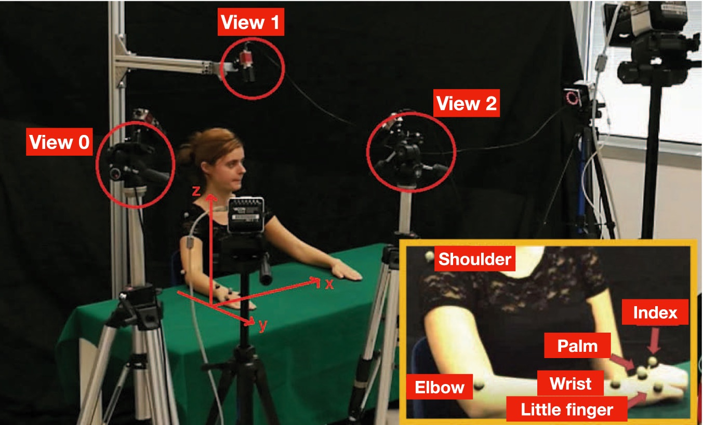

# The MoCA project

## The MoCA dataset, kinematic and multi-view visual streams of fine-grained cooking actions

=============

### Description and motivations
The Cooking Actions Dataset is a multimodal dataset in which we collect MoCap data and video sequences acquired from multiple views of upper body actions in a cooking scenario. 
It has been collected with the specific purpose of investigating view-invariant action properties in both biological and artificial systems, and in this sense it may be of interest for multiple research communities in the cognitive and computational domains. Beside addressing classical action recognition tasks, the dataset enables research on different nuances of action understanding, from the segmentation of action primitives robust across different sensors and viewpoints, to the detection of actions categories depending on their dynamic evolution or the goal. 

  

The dataset includes 20 cooking actions, involving either a single or both arms of the volunteer, some of them including tools which may require different forces. Three different view-points have been considered for the acquisitions, i.e. lateral, egocentric, and frontal. For each action a training and a test sequence is available, each containing, on average, 25 repetitions of the action. Furthermore, acquisitions of more structured activities are included, in which the actions are performed in sequence for a final, more complex goal. 

An annotation is available, which includes the segmentation of single action instances in terms of time instants in the MoCap reference frame. A function then allows to map the time instants on the corresponding frame in the video sequences. In addition, functionalities to load, segment, and visualize the data are also provided in Python and Matlab.

### Technical information
MATLAB structures containing the MoCap streams are composed by the following fields:
- Shoulder, elbow, wrist, palm, index finger and little finger complete streams, without any filtering; 
- index, array containing segmentation indices, this is the information used in segmentAction to separate the streams;
- labels (present only in the scenes structures), array containing the labels of the actions that succeed one another in the scene (in temporal order). True labels include also \enquote{pause}, a moment in the sequence in which the actor does not move;

The point of view of the video recordings is specified by the number at the end of each filename: "*_0.avi" for the lateral PoV, "*_1.avi" for a simulated egocentric PoV (the camera is placed above the head of the actor), "*_2.avi" for the frontal PoV.

### Available functions
Loading and visualisation functions (both available in MATLAB and Python) allow users to access RGB and Kinematic streams.

Functions "loadDataset" and "loadAction" allow the user to load and save the Cooking Actions Dataset in an easy-to-use data structure. 
"loadAction" gives the user the possibility of loading only part of the Cooking Actions Dataset, as for instance an action, a marker, or an instance.

Syntax:
- loadDataset(folder, 'training') and loadDataset(folder, 'test') load MoCap data of all actions for the specified set.
- loadAction(folder, action) and loadAction(folder, action, 'ALL') return a struct containing data of all markers for the specified action. Notice that "action" is a string that can be derived from the names of the data files. Example: carrot_tr.mat -> carrot
- loadAction(folder, action, marker) returns a struct containing data related to the specified action and limited to the specified marker  
- loadAction(folder, action, 'ALL', instance) returns a struct containing data of all markers at the specified instance of  the action.
- loadAction(folder, action, marker, instance) returns a struct containing data of a single marker at the specified instance of the action.

The function "segmentAction" extracts the instances of actions from the  MoCap streams. Same function can be used to segment the scenes in different actions.

Three types of visualisation functions are available:
- "visualiseAction", for 3D plot of each marker's trajectory 
- "visualiseSkeleton", for a simulation of the arm executing the complete action using MoCap data
- "initSynch" and "synchronizedView" for a joint view of RGB and Kinematic data.
	
All the functions provided can be used also on the testing scenes in /data/mocap/scenes.

Type help "name of the function" in the Command Window for more information on syntax and on how to use the functions.
	
REFERENCE
=============
Should you use this dataset in your publication please cite the following:

The MoCA dataset, kinematic and multi-view visual streams of fine-grained cooking actions
E. Nicora, G. Goyal, N. Noceti, A. Vignolo, A. Sciutti, F. Odone
Scientific Data 7 (1), 1-15

Further information can be found either on the main journal paper or at this <a href="insert link here">link</a>

